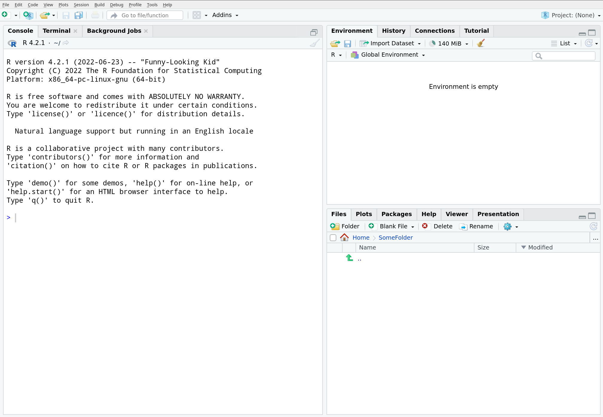

```{r setup, include=FALSE}
knitr::opts_chunk$set(echo = TRUE)
```

R and RStudio are both free and open-source. Please install them on your laptop as described below.

## Step 1: Install R

The installer is here: https://cran.rstudio.com/

Choose the appropriate installer for your operating system. The latest release of R is 4.2.2 (Innocent and Trusting). 

- Mac users: pay attention to the MacOS prerequisites, and choose the appropriate version for your system (Apple silicon arm64 or Intel). R version 4.2.2 requires MacOS 10.13 or greater. 
- Windows users: just run the .exe file. 
- Linux users: R can often be found using the package manager (e.g., see [these instructions](https://www.digitalocean.com/community/tutorials/how-to-install-r-on-ubuntu-22-04) for getting the latest version of R for Ubuntu.)

## Step 2: Install RStudio

Once you have installed R, you can install RStudio Desktop using the installer that you can get here: https://posit.co/download/rstudio-desktop/

Again, choose the appropriate installer. 

- Mac Users: Notice that the latest version of RStudio requires MacOS 10.15 or greater. If you have an older version of MacOS (e.g., 10.13), you will need to use an [older installer](https://www.rstudio.com/products/rstudio/older-versions/) (e.g., Version 1.3.1093 should work on MacOS 10.13). Also, make sure you complete the step of dragging the RStudio icon into the Applications folder.

## Step 3: Test the installation and install some packages

When you launch RStudio for the first time, the interface should look something like this:



The **Console** pane on the left is where you can type commands and view their output. For example, if you type

```{r eval=FALSE}
2 + 2
```

in the console and hit the *enter* key, you should see the result in the console.

Install the `tidyverse` and `ISLR2` packages by executing the following command in the console.

```{r eval=FALSE}
install.packages(c("ISLR2", "tidyverse"), type = "binary")
```

This command will install several packages and data sets that we will use throughout the course. It might take a while to finish. If you encounter any error messages, take a screenshot and email me.

You can test these packages by executing the following commands in the console.

```{r eval=FALSE}
library(tidyverse)
library(ISLR2)
ggplot(Bikeshare, aes(x = temp, y = bikers)) + geom_point()
```

If all went well, a scatterplot should appear in the **Plots** pane on the right.


