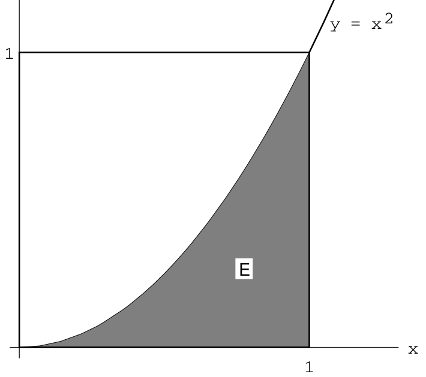

```{r setup, include=FALSE}
knitr::opts_chunk$set(echo = TRUE)
knitr::opts_chunk$set(comment = NA)
options(width = 100)
```


# Overview

For further reading, see [GS], pp. 41-70.

# Simulation of Continuous Probabilities

## (Pseudo-) Random Number Generation  

- Assume we have a function $\text{rnd}$ that returns a random number in the interval $[0,1]$.
    - Physical model: Spinner
    - In R, the `runif` function implements $\text{rnd}$.

```{r}
runif(5)
```

## Monte Carlo Procedures

Problem: Estimate $\text{Area of } E = \int_0^1 x^2 \, dx$ without calculus.


```{r, echo=FALSE, fig.align='center', fig.width=4}

```

Solution: Generate pairs $x = \text{rnd}$ and $y = \text{rnd}$ and compute the proportion of times $y < x^2$. (See console.)

## Monte Carlo integrals in R

```{r}
set.seed(3242)
n <- 100000
x <- runif(n)
y <- runif(n)
sum(y < x^2)/n
```

*Note:* In general you need to multiply by the area of the rectangle, too.

## Group Exercise

You are given a sheet of paper with parallel lines and a nail. The length of the nail is the distance between the lines.

- Drop the nail 10 times on the paper. Make sure it lands inside the margins.
- Keep track of the number of times the nail lands touching one of the lines.

## Buffon's Needle

Two things are random and independent:

- The distance between the center of the needle and the nearest line. 
    - $d = \frac{1}{2} \text{rnd}$
    - $0 \leq d \leq 1/2$
- The acute angle made by the line of the needle and the lines.
    - $\theta = \frac{\pi}{2} \text{rnd}$
    - $0 \leq \theta \leq \pi/2$

The needle will intersect a line iff $\displaystyle{\frac{d}{\sin\theta} < \frac{1}{2}}$. (board, then console)

## Buffon's Needle in R

```{r}
set.seed(8783)
n <- 100000
d <- runif(n, min = 0, max = 0.5)
theta <- runif(n, min = 0, max = pi/2)
sum(d < 0.5 * sin(theta))/n
```

## Buffon's Needle: Exact Solution

- We are drawing $(\theta, d)$ from the rectangle $[0, \pi/2] \times [0, 1/2]$.
- We are counting the points where $d < \frac{1}{2}\sin(\theta)$.
    - This is like doing a Monte Carlo estimate of an integral.
- So we are estimating the following:

$$
\frac{1}{\pi/4} \int_0^{\pi/2} \frac{1}{2}\sin \theta \, d\theta = \frac{2}{\pi}
$$

# Continuous Density Functions

## Models for Continuous Random Variables

- We have a sample space $\Omega$ which is a subset of $\mathbb{R}^n$ for some $n$.
    - For example, when $n = 1$ and our sample spaces will usually just be intervals $[a,b]$.
- We need a way to assign probabilities to an event $E \subseteq \Omega$.
- Three motivating examples:
    - $\Omega = [0,1]$, $X = \text{rnd}$ 
    - $\Omega = [0,2]$, $X = \text{rnd}_1 + \text{rnd}_2$
    - $\Omega = [0,1]$, $X =$ distance of a random dart from the bull's eye
    
## Histograms

- You have a bunch of values in an interval $[a,b]$; How are they distributed?
- Break $[a,b]$ into several **bins**: a partition of subintervals.
- Make a bar graph: the height of each bar is the number of values in each bin.

## Frequency histogram of $X = \text{rnd}$ {data-transition="slide-in fade-out"}

```{r, fig.align='center', fig.width=4, fig.height=3}
n <- 10000
set.seed(314)
values <- runif(n)
hist(values)
```

## Density histogram of $X = \text{rnd}$ {data-transition="fade-in slide-out"}

```{r, fig.align='center', fig.width=4, fig.height=3}
n <- 10000
set.seed(314)
values <- runif(n)
hist(values, freq = FALSE) # density histogram
```

## Density histogram of $X = \text{rnd_1} + \text{rnd}_2$ 

```{r, fig.align='center', fig.width=4, fig.height=3}
n <- 10000
set.seed(314)
values <- runif(n) + runif(n)
hist(values, freq = FALSE) # density histogram
```

## Darts: distance from center

- Throw a dart so that it lands randomly inside the circle $x^2 + y ^2 = 1$.
- $X = \sqrt{x^2 + y^2}$

```{r}
dartdist <- function() {
  dsq <- runif(1)^2 + runif(1)^2
  while(dsq > 1) 
    dsq <- runif(1)^2 + runif(1)^2
  return(sqrt(dsq))
}
```

## Density histogram of dart distance

```{r, fig.align='center', fig.width=4, fig.height=3}
n <- 10000
set.seed(5678)
values <- replicate(10000, dartdist())
hist(values, freq = FALSE)
```

## Model for continuous probability

- We can use a histogram to estimate the probability that $X$ lands in a *range* of values.
- We can model the distribution with a function $f(x)$ such that $\displaystyle{\int_\Omega f(x) \, dx = 1}$.
- We can then calculate the probability of an event $E \subseteq \Omega$ as $P(X \in E) = \displaystyle{\int_E f(x) \, dx }$.

Such a function $f$ is called a **probability density function** (PDF).

# Probability Density Functions

## Definition

*Definition 2.1.* Let $X$ be a continuous real-valued random variable. A **density function** for $X$ is a real-valued function $f$ such that, for all $a,b \in \mathbb{R}$,

$$
P(a \leq X \leq b) = \int_a^b f(x) \, dx.
$$

. . .

Under mild conditions on $f$, we have $f(x) \geq 0$ for all $x \in \mathbb{R}$, and

$$
\displaystyle{\int_{-\infty}^\infty f(x) = 1}
$$

## Example: Uniform Density

Suppose $X$ takes values on the interval $[l, r]$, and each point is equally likely. Then $X$ is distributed according to the **uniform** distribution:
$$
f(x) = \begin{cases}
1/(r-l), & \text{if } l \leq x \leq r \\
0, & \text{otherwise.}
\end{cases}
$$

## Example: Darts

Let $X$ be the distance a random dart landing in the unit circle is from $(0,0)$. Claim: Its PDF is
$$
f(x) = \begin{cases}
2x, & \text{if } 0 \leq x \leq 1\\
0, & \text{otherwise.}
\end{cases}
$$

. . .

*Proof:* The event that $a \leq X \leq b$ corresponds to the dart landing in a certain annulus. The area of this annulus divided by the area of the circle is $b^2-a^2$, which equals $\int_a^b f(x)\, dx$.

## Cumulative Distribution Functions (CDFs)

*Definition 2.2.*  Let $X$ be a continuous real-valued random variable. The **Cumulative Distribution Function** (CDF) of $X$ is defined as 
$$
F(x) = P(X \leq x)
$$

. . .

It follows that, if $f(x)$ is a PDF for $X$, then
$$
F(x) = \int_{-\infty}^x f(t) \, dt
$$
and therefore, by the second Fundamental Theorem of Calculus, $f(x) = F'(x)$.

## Example: Uniform CDF

Suppose $X$ has a uniform distribution on $[0,1]$. In other words, $X = \text{rnd}$. Its CDF is
$$
F(x) = \begin{cases} 
0, & \text{if } x < 0 \\
x, & \text{if } 0 \leq x \leq 1 \\
1, & \text{if } x>1
\end{cases}
$$

## Example: $Z = \text{rnd}_1 + \text{rnd}_2$

Suppose $Z = X + Y$, where $X$ and $Y$ are uniform random variables on $[0,1]$.

- The values of $X$ and $Y$ fall in the square $[0,1] \times [0,1]$.
- The CDF $F(z) = P(Z \leq z) = P(X + Y \leq z)$.
    - The value of $F(z)$ corresponds to the area of a subregion of $[0,1]\times [0,1]$. (board)
    - So the CDF is:
    
$$
F(z) = \begin{cases}
0, & \text{if } z<0 \\
z^2/2, & \text{if } 0 \leq z \leq 1 \\
1 - (2-z)^2/2, & \text{if } 1 \leq z \leq 2 \\
1, &\text{if } z > 2
\end{cases}
$$

Get the PDF by differentiating.

## The exponential distribution

Let $\lambda>0$ be a real parameter. The **exponential** density function is

$$
f(x) = \begin{cases}
\lambda e^{-\lambda t}, & \text{if } t \geq 0 \\
0, & \text{if } t < 0
\end{cases}
$$

Applications:

- $X=$ the time till the next earthquake.
- $X=$ how long your hard drive is going to last.

